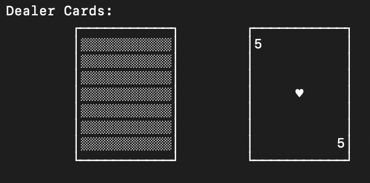
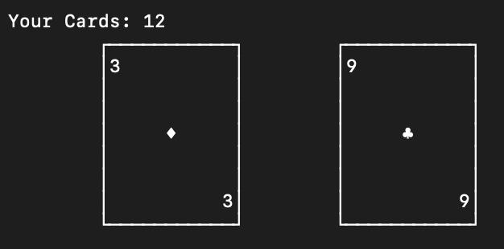
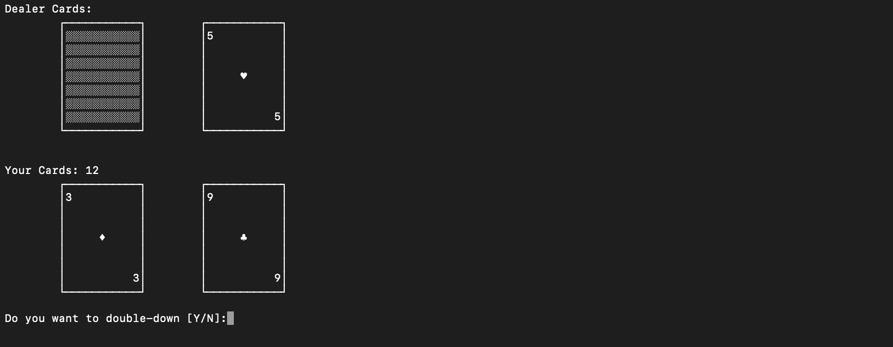
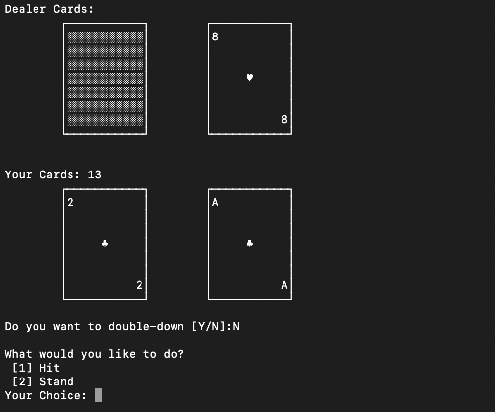
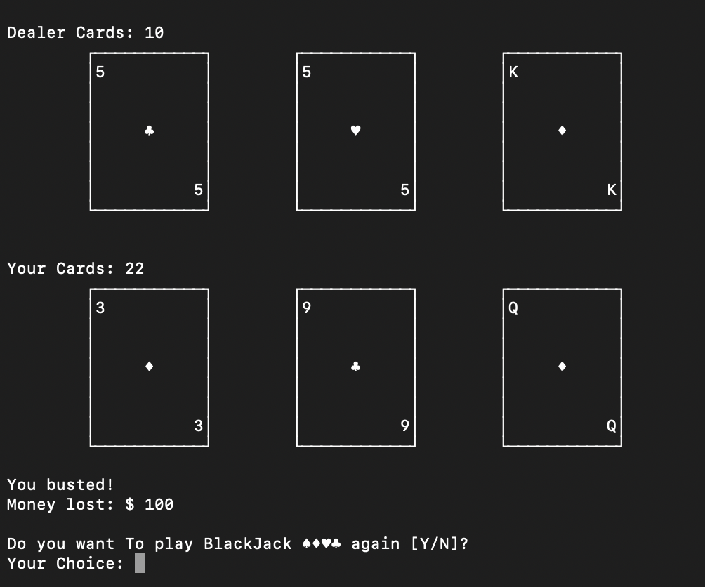
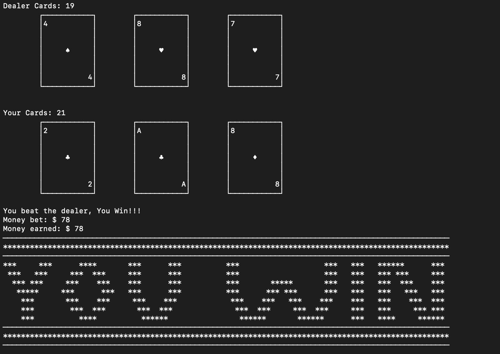

# Blackjack Console Game
## Introduction 
Blackjack Console game is the traditional game of Blackack that can be played in the console.
## Overview of the Design
Blackjack Console game is a single player Blackjack game that gives the option of Double Down and handles soft 17. For displaying cards, UTF-8 linux based symbols are used
### Flow of control:

### Design in Detail

**Language:** Python3\
**Data Structure:** lists\
**Concepts:** Classes and Objects, Iteration, Functions/Methods\
**Packages/Classes:** Random, os (name, system)

### User Interface:
Dealer's Cards:\

Player's Cards:\

Distributed Cards:\

Menu/Double Down:\

Loss:\

Win:

## Rules of the game: 

1. If a player hand gets more than 21 points, player busts (loss)
2. If a player gets 21 and the dealer also has a 21 in the first hand, it is a push (no win/loss)
3. If only the player gets 21 in the fist hand, he wins 3 to 2 (win)
4. If the dealer has 21, he busts (win)
5. If the delaer and the player, both bust (loss)
6. If the dealer is less than 21 and player is bigger than dealer, the player wins (win)
7. If the player is less than the dealer, the dealer wins (loss)
8. If the player and the dealer are equal, it is a push (no loss/win)
9. The player can double down during the first hand i.e. he can double the investement during the first hand and has to take only one more card
10. Dealer hits on 16 and stands on 17

## Next Steps
**Introduce the following**
1. Surrender
2. Soft-17/Hard-17
3. Multiplayers 
4. Split

## Resources 
